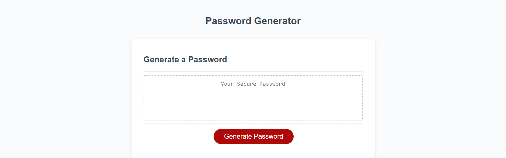

# Password-Generator

# Description

This application required the knowledge of javascript and performing a set of functions to randomize 4 sets of characters for a high security password with the addition of asking for a user's input.

## Table of Contents

* [License](#license)
* [Contributing](#contributing)
* [Screenshot](#screenshot)
* [Link](#link)
* [Questions](#questions)

## License

MIT

## Contributing

I am the sole contributor on this project.

# Screenshot
Here is a mock of the Weather App.

# Link
Take a look at the live version [here.](https://martinrenteria.github.io/UWCB-HW03-Password-Generator/)

## Questions

If you have any questions, please contact me with the information below.

[GitHub: MartinRenteria](https://github.com/MartinRenteria)

Email: renteriamp96@gmail.com